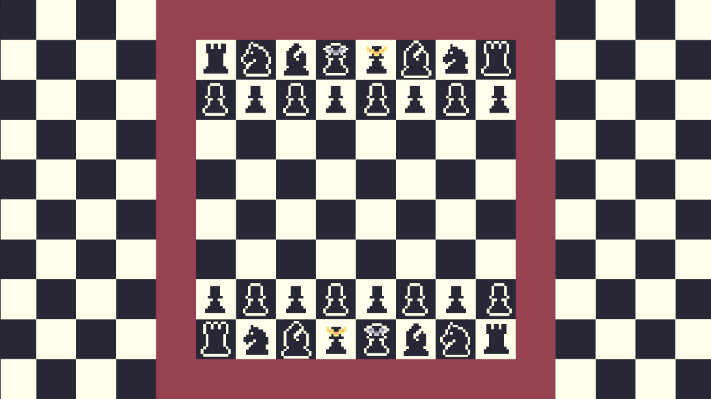

# ♟️ UltraChess  
Um jogo de xadrez desenvolvido em Unity.  

## 📖 Sobre  
UltraChess é um projeto de xadrez criado na Unity, com o objetivo de proporcionar uma experiência imersiva e divertida para jogadores de todos os níveis.  

## 🚀 Recursos  
📜 Movimento completo das peças baseado nas regras oficiais do xadrez.  
📜 Suporte para multiplayer online/local. *(opcional)*  
📜 Interface intuitiva e responsiva.  
📜 Registro de jogadas e sistema de histórico.  
📜 Temas customizáveis para o tabuleiro e peças. *(opcional)*  

### 📌 Status do desenvolvimento  
- 📜 **Em produção**  
- ✅ **Completo**  

## 🛠️ Tecnologias Utilizadas  
- 🎮 **Unity**  
- 👨‍💻 **C#**  
- 🎨 **Aseprite** 

## 📸 Capturas de Tela 

*Versão preliminar - 27/02/2025

## 🤝 Contribuição
Se quiser contribuir, fique à vontade para abrir uma **issue** ou enviar um **pull request**.  

---
